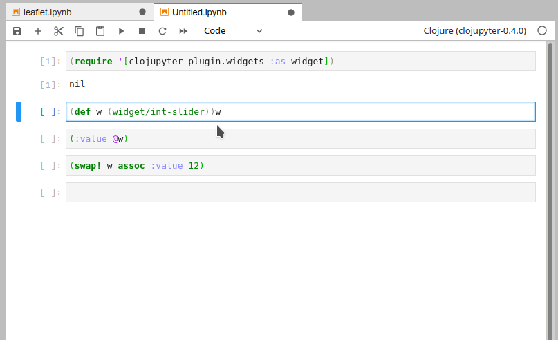

# widgets
Interactive widgets for clojupyter.

## Usage
The widget models are found in the `clojupyter-plugin.widgets` namespace.

```clojure
(require '[clojupyter-plugin.widgets :as widget])
```
A widget is a clojure object whose state gets synced with the front-end.
It acts as an atom, it can be used with `deref`, `swap!`, `reset!`, `compare-and-set!` and it supports adding and removing `watchers` and `validators`.



The state is represented by a hash-map i.e. `{:min 0 :max 100 :value 20 ...}`.
The attributes that get sent to the front-end must be converted to json so they can't contain nested keys, clojure functions or java classes as values.

For more examples, check out the examples directory.

## Build
```bash
$ lein metajar
```

## Installation
The packages installs itself as a clojupyter plugin. In order to use it, you'll need to install a version of clojupyter which supports plugins (0.4.0 or later).

Make sure you've built the metajar and run:
```bash
$ bin/install <kernel identity>
```

To make the plugin available at runtime, you'll need to enable the plugin manually:
```bash
$ cd <clojupyter src dir>
$ bin/enable-plugin -k <kernel identity> widgets
```
To view and interact with the models, you also need to install the right extension for your front end.
For **jupyter notebook** install **widgetsnbextension** plugin and for **jupyter lab** install **jupyterlab-manager** plugin.
